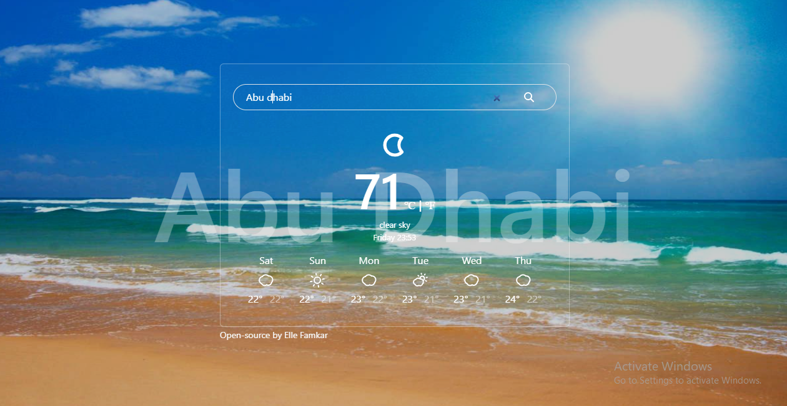
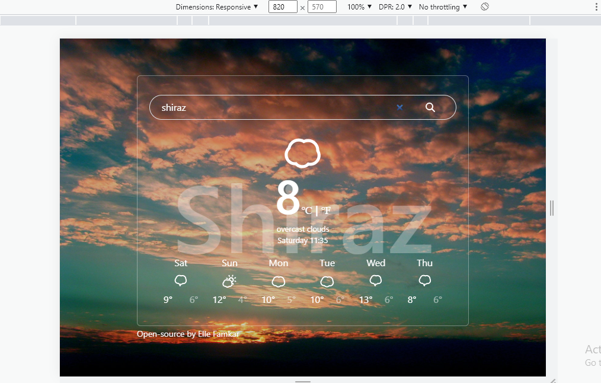
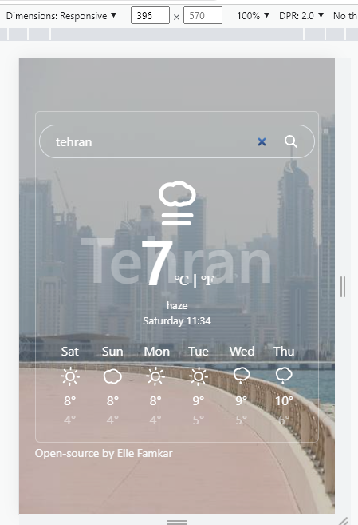

# Welcome to my React Weather Application 👋

## Available Scripts

In the project directory, you can run:
### `npm start`

## Table of contents

- [Overview](#overview)
  - [The challenge](#the-challenge)
  - [Screenshot](#screenshot)
  - [Links](#links)
- [My process](#my-process)
  - [Built with](#built-with)
  - [What I learned](#what-i-learned)
  - [Continued development](#continued-development)
  - [Useful resources](#useful-resources)
- [Author](#author)
- [Acknowledgments](#acknowledgments)

## Overview

Thanks for checking out my weather app project which was inspired by [SheCodes React](https://www.shecodes.io/).
Remember that "Every day is a learning day" and try to learn from everyone! 

 ### Screenshot 





### Links

- Live Site URL: [React Weather Application](https://fluffy-khapse-918d79.netlify.app/)

## My process

### Where to find resources

The first think to do is to look for your perfect design! So let's checkout [dribble](https://dribbble.com/) our favourite design to begin!

### Built with

- Reactjs
- SheCodes Weather API
- Axios
- bootstrap npm package
- ReactAnimatedWeather
- Semantic HTML5 markup
- CSS
- Flexbox
- CSS Grid
- Mobile-first workflow

You can use any tools you like to help you complete the project. So if you got something you'd like to practice, feel free to give it a try. However, i wrote this design with simple html5 and css and made it responsive for all the devices, since my users should be able to: View the optimal layout and hover or active states depending on their device's screen size

### What I learned

This projects helped me being more familiar with the details of react and how to work with react components, hosting and API, and use my css knowledge as well to create a responsive project with small details on colors,sizes and so on. I also tried amazing components wich are gonna be listed soon!

To see parts of my codes and see how you can add code snippets, see below:

``` JSX
  
const WeatherForecast = ({coordinates}) => {
    let[loaded, setLoaded] = useState(false);
    let[forecast, setForecast]=useState(null);

    useEffect(() => {
        setLoaded(false);
      }, [coordinates]);

      
    const handleResponse = (response) =>{
        setForecast(response.data.daily);
        setLoaded(true);
    };

    const load = () =>{
        const apiKey = 'f0bata7385ff184aeb7o2efc0a37f732';
        let units = "metric";
        let latitude = coordinates.latitude;
        let longitude = coordinates.longitude;
        let apiUrl = `https://api.shecodes.io/weather/v1/forecast?lon=${longitude}&lat=${latitude}&key=${apiKey}&units=${units}`;
        axios.get(apiUrl).then(handleResponse);
    }

    if(loaded){
        return (
            <div className="container">
                <div className='row mt-2'>
                    {
                        forecast.map((dailyForecast, index)=>{
                            if( index < 6 ){
                                return (<div className='forecast-details col-2' key={index}>
                                 <WeatherForecastDay data={dailyForecast} />
                                </div>
                                );
                            }else{
                                return null;
                            }
                        })
                    }
                </div>
            </div>
        );
    }else{
        load();
        return null;
    }
};
```
```css
    .App {
    text-align: center;
    text-align: center;
    border: 1px solid #eaeaea;
    border-radius: 6px;
    min-width: 560px;
    padding: 2rem;
    }
```

### Useful resources

In order to do this project in a correct way you need to have a good knowledge of html and css and js, so let's master at them with these fruitful resources.

- [w3schools](https://www.w3schools.com/) - This helps you a lot with both your css and html which is easy to read and has numerous examples.
- [MDN](https://developer.mozilla.org/en-US/) - Remember that no matter how many tutorial videos you have watched, you always need to learn details and features from codes documentations
- [codeacademy](https://www.codecademy.com/)
- [udemy](https://www.udemy.com/) - Here you can find a number of tutorials in different languages
- [coursera](https://www.coursera.org/)

## Author

- Website - [Elle Famkar](https://bespoke-marigold-f2f8e3.netlify.app/)
- Twitter - [@Ellefamkar](https://www.twitter.com/ellefamkar)

Feel free to ask any questions come to your mind  and send me message via my current temporary website in the link above!

## Acknowledgments

I am thankful to each and every person in this area who teaches me a single piece of code! I learn every single day from amazing people! so I need to thank you all ❤

**Have fun using this project!** 🚀
